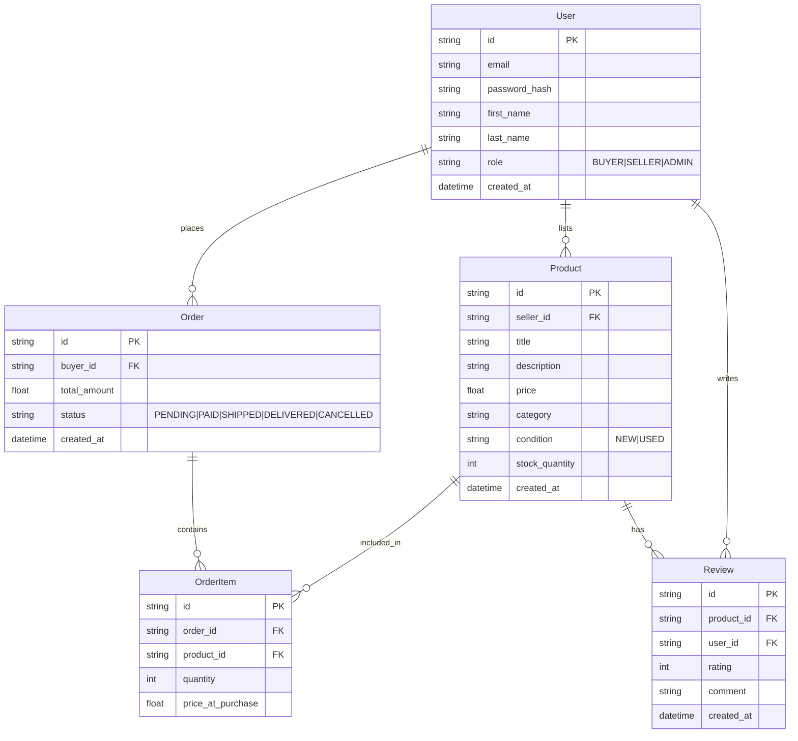

# Database Schema (ER Diagram)

```mermaid
erDiagram
    User {
        string id PK
        string email
        string password_hash
        string first_name
        string last_name
        string role "BUYER|SELLER|ADMIN"
        datetime created_at
    }

    Product {
        string id PK
        string seller_id FK
        string title
        string description
        float price
        string category
        string condition "NEW|USED"
        int stock_quantity
        datetime created_at
    }

    Order {
        string id PK
        string buyer_id FK
        float total_amount
        string status "PENDING|PAID|SHIPPED|DELIVERED|CANCELLED"
        datetime created_at
    }

    OrderItem {
        string id PK
        string order_id FK
        string product_id FK
        int quantity
        float price_at_purchase
    }

    Review {
        string id PK
        string product_id FK
        string user_id FK
        int rating
        string comment
        datetime created_at
    }

    User ||--o{ Product : "lists"
    User ||--o{ Order : "places"
    User ||--o{ Review : "writes"
    Product ||--o{ OrderItem : "included_in"
    Order ||--o{ OrderItem : "contains"
    Product ||--o{ Review : "has"
```
