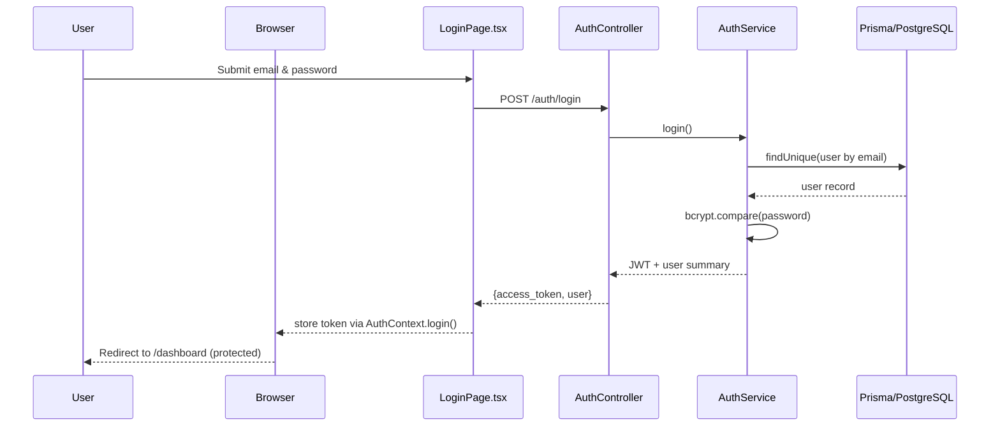
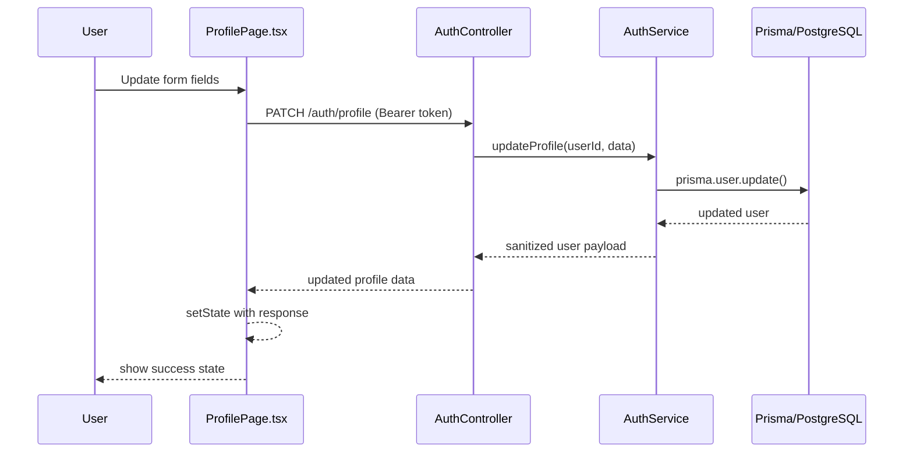
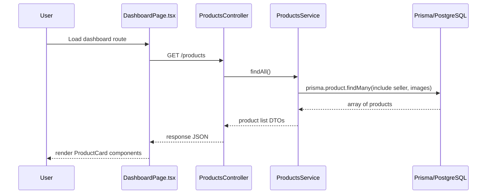

# Pickleball Marketplace Onboarding Guide

## 1. Overview

Pickleball Marketplace (a.k.a. PickleZone) is an enterprise-oriented platform for buying, selling, and managing pickleball equipment. It delivers a responsive React single-page application backed by a NestJS API with Prisma ORM and PostgreSQL. The system emphasizes modular domain boundaries (auth, users, products) and lays groundwork for marketplace capabilities such as order management, reviews, and inventory tracking....

**Key Capabilities**
- User authentication, profile management, password recovery
- Product catalog management with imagery and seller attribution
- Foundational order, review, and inventory entities ready for expansion
- React frontend with protected routes, reusable UI components, and API integration

**Primary Technologies**
- Frontend: React 18, Vite, React Router v6, Tailwind CSS, shadcn/ui, Axios, React Query scaffold
- Backend: NestJS, Passport JWT, Prisma ORM, class-validator, bcrypt
- Data: PostgreSQL (via Prisma), Prisma migrations and seeding utilities
- Infrastructure baseline: AWS-oriented design (RDS, S3, Cognito, SES) per project docs

## 2. High-Level Architecture Diagram

```mermaid
graph TB
    subgraph Client
        WebApp[Web App (React + Vite)]
        AuthCtx[Auth Context & Protected Routes]
    end

    subgraph Server
        ApiGateway[NestJS AppModule]
        AuthSvc[AuthModule & AuthService]
        ProdSvc[ProductsModule & ProductsService]
        UserSvc[UsersModule & UsersService]
        PrismaSvc[PrismaService]
    end

    Postgres[(PostgreSQL Schema)]

    WebApp --> AuthCtx
    AuthCtx -->|REST| ApiGateway
    ApiGateway --> AuthSvc
    ApiGateway --> ProdSvc
    ApiGateway --> UserSvc
    AuthSvc --> PrismaSvc
    ProdSvc --> PrismaSvc
    UserSvc --> PrismaSvc
    PrismaSvc -->|Queries| Postgres

    click WebApp "apps/web/src/App.tsx" "Open SPA router"
    click AuthCtx "apps/web/src/context/AuthContext.tsx" "Auth context provider"
    click ApiGateway "apps/api/src/app.module.ts" "NestJS root module"
    click AuthSvc "apps/api/src/auth/auth.module.ts" "Auth module definition"
    click ProdSvc "apps/api/src/products/products.module.ts" "Products module"
    click UserSvc "apps/api/src/users/users.module.ts" "Users module"
    click PrismaSvc "apps/api/src/prisma/prisma.service.ts" "Prisma service"
    click Postgres "apps/api/prisma/schema.prisma" "Database schema"
```

**Component Summaries**
- **Web App**: React SPA delivering all client experiences and protected routes.
- **Auth Context**: Frontend state wrapper managing JWT storage, session restoration, and guarded navigation.
- **AppModule**: NestJS bootstrap that composes feature modules and configuration.
- **AuthModule**: Authentication endpoints, JWT issuance, profile management, and guards.
- **ProductsModule**: Product catalog CRUD with seller and image relations.
- **UsersModule**: User CRUD services consumed by auth and future admin tooling.
- **PrismaService**: Shared ORM gateway for data access.
- **PostgreSQL Schema**: Normalized relational store for marketplace entities.

## 3. Component Breakdown

### Component: Frontend SPA

**File**: [apps/web/src/App.tsx](apps/web/src/App.tsx)

**Purpose**: Defines client-side routing, protected route wrapper, and global layout composition.

**Key Elements**:
- [`ProtectedRoute`](apps/web/src/App.tsx#L30) – redirects unauthenticated users to `/login` while honoring loading state.
- [`QueryClientProvider`](apps/web/src/main.tsx#L9) – prepares React Query for server-state management.
- [`AuthProvider`](apps/web/src/context/AuthContext.tsx#L12) – wraps application with authentication context.

**Depends On**:
- Internal: `AuthContext`, page components under `apps/web/src/pages`, layout components.
- External: `react-router-dom`, `@tanstack/react-query`.

---

### Component: Auth Context

**File**: [apps/web/src/context/AuthContext.tsx](apps/web/src/context/AuthContext.tsx)

**Purpose**: Centralizes user session state, token persistence, and exposes login/logout utilities.

**Key Elements**:
- [`useEffect` bootstrap](apps/web/src/context/AuthContext.tsx#L29) – restores session via `/auth/profile` with stored token.
- [`login`](apps/web/src/context/AuthContext.tsx#L46) – saves JWT, updates user state.
- [`logout`](apps/web/src/context/AuthContext.tsx#L52) – clears token and resets context.

**Depends On**:
- Internal: `lib/api.ts` axios instance.
- External: `axios`, `React` hooks, browser `localStorage`.

---

### Component: Auth Module (Backend)

**File**: [apps/api/src/auth/auth.module.ts](apps/api/src/auth/auth.module.ts)

**Purpose**: Encapsulates authentication concerns including controllers, services, JWT strategy, and guards.

**Key Elements**:
- [`AuthController`](apps/api/src/auth/auth.controller.ts#L9) – routes for login, signup, password reset, profile.
- [`AuthService`](apps/api/src/auth/auth.service.ts#L10) – credentials validation, token issuance, profile updates.
- [`JwtStrategy`](apps/api/src/auth/jwt.strategy.ts#L9) – Passport strategy extracting & validating Bearer tokens.
- [`JwtAuthGuard`](apps/api/src/auth/guards/jwt-auth.guard.ts#L6) – guard applied on protected endpoints.

**Depends On**:
- Internal: `UsersModule` (for user lookups), `PrismaService`.
- External: `@nestjs/jwt`, `passport-jwt`, `bcrypt`, `crypto`.

---

### Component: Users Module (Backend)

**File**: [apps/api/src/users/users.module.ts](apps/api/src/users/users.module.ts)

**Purpose**: Provides user data access and controller endpoints for listing and retrieving users.

**Key Elements**:
- [`UsersController`](apps/api/src/users/users.controller.ts#L8) – GET endpoints for user retrieval.
- [`UsersService`](apps/api/src/users/users.service.ts#L8) – CRUD wrappers around Prisma user model.
- [`CreateUserDto`](apps/api/src/users/dto/create-user.dto.ts#L1) – DTO for user creation scenarios.

**Depends On**:
- Internal: `PrismaService`.
- External: NestJS dependency injection, Prisma generated types.

---

### Component: Products Module (Backend)

**File**: [apps/api/src/products/products.module.ts](apps/api/src/products/products.module.ts)

**Purpose**: Manages product catalog endpoints, dto validation, and product imagery associations.

**Key Elements**:
- [`ProductsController`](apps/api/src/products/products.controller.ts#L8) – POST/GET endpoints with optional category filtering.
- [`ProductsService`](apps/api/src/products/products.service.ts#L6) – orchestrates product creation with nested image writes.
- [`CreateProductDto`](apps/api/src/products/dto/create-product.dto.ts#L1) – request payload contract for product creation.

**Depends On**:
- Internal: `PrismaService`, user records for seller linkage.
- External: NestJS routing decorators.

---

### Component: Prisma Module & Service

**File**: [apps/api/src/prisma/prisma.service.ts](apps/api/src/prisma/prisma.service.ts)

**Purpose**: Provides a globally scoped Prisma client with lifecycle-managed connections.

**Key Elements**:
- [`PrismaService`](apps/api/src/prisma/prisma.service.ts#L6) – extends `PrismaClient`, connects on module init.
- [`PrismaModule`](apps/api/src/prisma/prisma.module.ts#L6) – marks service as `@Global` for DI reuse.

**Depends On**:
- Internal: Prisma schema and migrations.
- External: `@prisma/client`.

---

### Component: Marketplace Pages

**File**: [apps/web/src/pages](apps/web/src/pages)

**Purpose**: End-user views (home, dashboard, profile, authentication screens) composed with shared components.

**Key Elements**:
- [`HomePage`](apps/web/src/pages/HomePage.tsx#L1) – public marketing view with featured products.
- [`DashboardPage`](apps/web/src/pages/DashboardPage.tsx#L1) – authenticated summary of orders, listings, metrics.
- [`ProfilePage`](apps/web/src/pages/ProfilePage.tsx#L1) – profile editor calling `/auth/profile` endpoints.
- [`LoginPage` & `SignupPage`](apps/web/src/pages/LoginPage.tsx#L1) – forms posting to authentication API.

**Depends On**:
- Internal: `AuthContext`, UI components (`ProductCard`, `Layout`, `Sidebar`).
- External: `react-router-dom`, `axios` via `lib/api.ts`.

## 4. Data Flow & Call Flow Examples

### Example Flow: User Authentication

**Description**: A visitor logs in, obtaining a JWT stored client-side and enabling protected routes.

**Sequence Diagram**:


**Key Files**: [LoginPage.tsx](apps/web/src/pages/LoginPage.tsx), [auth.controller.ts](apps/api/src/auth/auth.controller.ts), [auth.service.ts](apps/api/src/auth/auth.service.ts), [Prisma schema](apps/api/prisma/schema.prisma)

---

### Example Flow: Profile Update

**Description**: An authenticated user edits profile details; the frontend syncs updates and refreshes context.

**Sequence Diagram**:


**Key Files**: [ProfilePage.tsx](apps/web/src/pages/ProfilePage.tsx), [auth.controller.ts](apps/api/src/auth/auth.controller.ts), [auth.service.ts](apps/api/src/auth/auth.service.ts)

---

### Example Flow: Product Listing Fetch

**Description**: The dashboard or marketplace view retrieves catalog items with seller and image context.

**Sequence Diagram**:


**Key Files**: [DashboardPage.tsx](apps/web/src/pages/DashboardPage.tsx), [products.controller.ts](apps/api/src/products/products.controller.ts), [products.service.ts](apps/api/src/products/products.service.ts), [schema.prisma](apps/api/prisma/schema.prisma)

## 5. Data Models (Entities)

### Entity: [User](apps/api/prisma/schema.prisma#L11)

- **Table**: `users`
- **Fields**:
  - `id: String` – UUID primary key (`@default(uuid())`)
  - `email: String` – unique constraint
  - `password_hash: String` – stored credential hash
  - `first_name: String`, `last_name: String`
  - `role: String` – logical roles (`BUYER`, `SELLER`, `ADMIN`)
  - Optional profile fields: `avatar`, `address`, `phone`, `bio`, `payment_methods`
  - Password recovery: `reset_token`, `reset_token_expiry`
  - Audit: `created_at`, `updated_at`
- **Relations**:
  - One-to-many with `Product` (seller)
  - One-to-many with `Order` (buyer)
  - One-to-many with `Review`
- **Notes**: Consider elevating role to Prisma enum and enforcing password reset token expiry indexes.

### Entity: [Product](apps/api/prisma/schema.prisma#L35)

- **Table**: `products`
- **Fields**:
  - `id: String` – UUID primary key
  - `seller_id: String` – FK to `users`
  - `title`, `description`, `category`, `condition`
  - `price: Float`, `stock_quantity: Int`
  - `created_at`, `updated_at`
- **Relations**:
  - Belongs to `User` (`seller`)
  - Has many `Image`, `OrderItem`, `Review`
- **Notes**: `condition` stored as string; potential enum candidate.

### Entity: [Image](apps/api/prisma/schema.prisma#L55)

- **Table**: `images`
- **Fields**: `id`, `url`, `product_id`
- **Relations**: Many images per product via `product_id`
- **Notes**: Extendable for alt text, ordering, or S3 key metadata.

### Entity: [Order](apps/api/prisma/schema.prisma#L64)

- **Table**: `orders`
- **Fields**: `id`, `buyer_id`, `total_amount`, `status`, `created_at`, `updated_at`
- **Relations**: Belongs to `User` (`buyer`), has many `OrderItem`
- **Notes**: Status string should match business workflow (pending → delivered). No shipment metadata yet.

### Entity: [OrderItem](apps/api/prisma/schema.prisma#L78)

- **Table**: `order_items`
- **Fields**: `id`, `order_id`, `product_id`, `quantity`, `price_at_purchase`
- **Relations**: Many-to-one to `Order` and `Product`
- **Notes**: Captures historical pricing for reporting.

### Entity: [Review](apps/api/prisma/schema.prisma#L91)

- **Table**: `reviews`
- **Fields**: `id`, `product_id`, `user_id`, `rating`, `comment`, `created_at`
- **Relations**: Many-to-one to `Product` and `User`
- **Notes**: No `updated_at`; consider adding for edit history.

**Global Data Considerations**
- Prisma migrations under `apps/api/prisma/migrations` manage schema evolution.
- Seed script (`apps/api/prisma/seed.ts`) mirrors entity relationships for sample data.
- Cascade rules not yet configured; deletes require manual cleanup or future `onDelete` policies.
